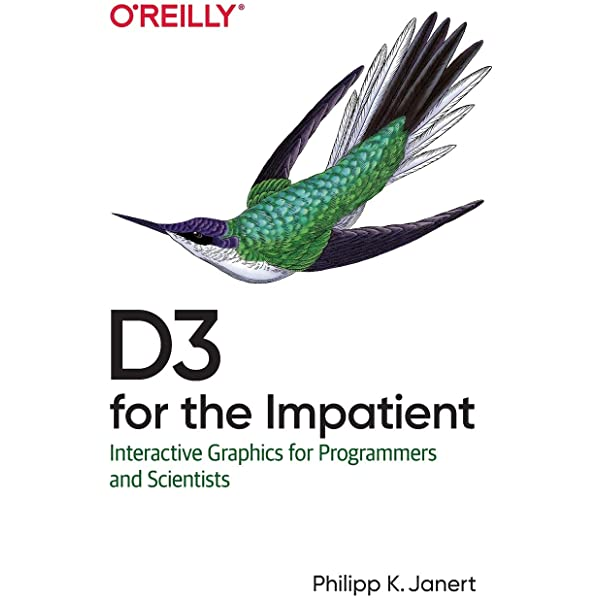

# d3_notes

Try to implement the examples in
[D3 for the Impatient: Interactive Graphics for Programmers and Scientists](https://www.amazon.com/D3-Impatient-Interactive-Programmers-Scientists/dp/1492046779/ref=sr_1_2?dchild=1&keywords=d3.js&qid=1612661644&s=books&sr=1-2)

## Draw the graphs

To display the examples on the server

    npm install -g http-server
    $ http-server

## Something new

d3.mouse was removed in d3v6, we use d3.pointer(event).
see example 07 for more information.
